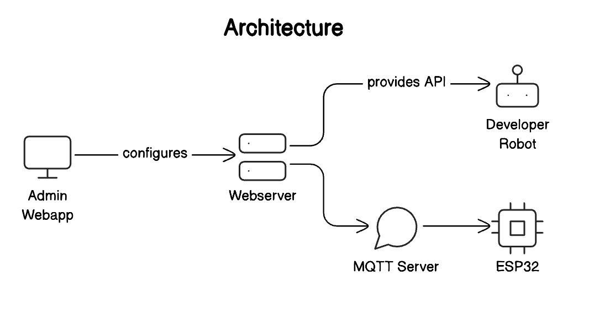

# How It Works

## Architecture Overview

The Smart Infrastructure Platform is designed to provide a seamless integration and management experience for a variety of devices. The platform's architecture consists of several key components that work together to deliver robust functionality and security.

### Key Components

1. **Admin Webapp**:

   - The Admin Webapp is the primary interface for administrators to configure and manage the system.
   - Through this web application, admins can add and manage devices, configure API keys, and monitor system activity.

2. **Webserver**:

   - The Webserver acts as the central hub, processing configurations and providing APIs.
   - It is responsible for communicating with both the Admin Webapp and the MQTT Server.
   - The Webserver ensures that the configurations set by the admins are properly applied to the system.

3. **MQTT Server**:

   - The MQTT Server handles the communication with devices using the MQTT protocol.
   - It acts as a message broker, enabling real-time messaging between the Webserver and the devices (e.g., ESP32).
   - The server ensures efficient and reliable data transmission, essential for IoT applications.

4. **ESP32 (or other devices)**:

   - Devices such as the ESP32 connect to the platform through the MQTT Server.
   - These devices perform various tasks as configured by the admins and report their status and activities back to the server.

5. **Developer Robot**:

   - The APIs are used by robot developers to control infrastructure securely
